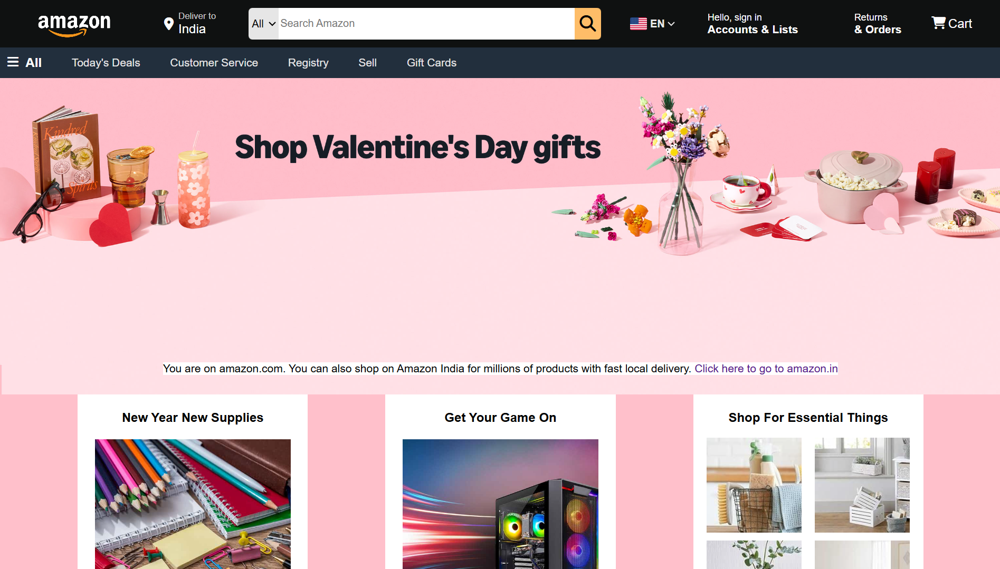
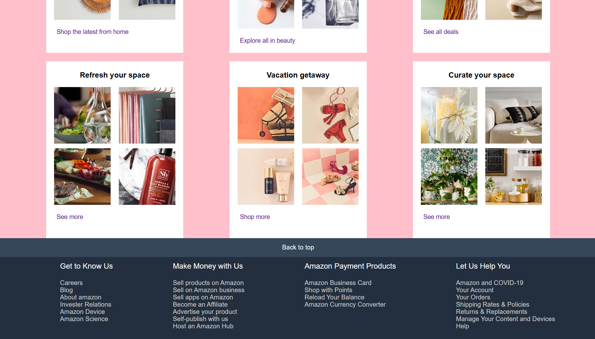
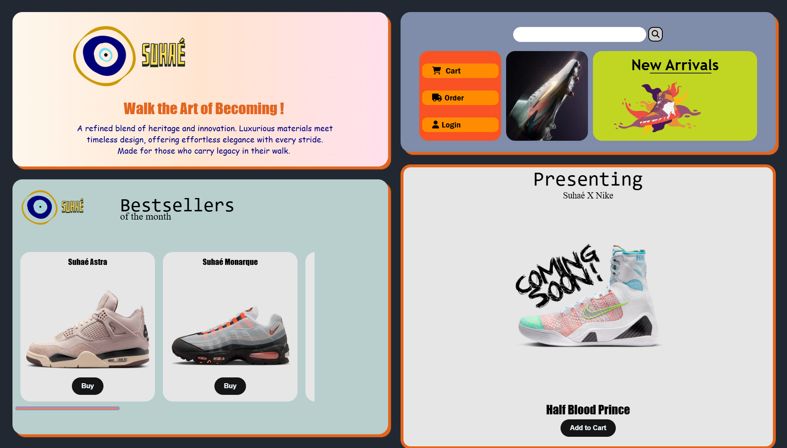

# 🧱 Web Designs by Ariyan Jadhav

A collection of static web design templates built using pure **HTML** and **CSS** — no frameworks, no responsiveness, just raw frontend layout experiments and creativity.  
Each project reflects a different concept, layout idea, or UI practice.

---

## 📸 Previews

| Project             | Preview                                     |
|---------------------|---------------------------------------------|
| **Amazon Clone**    |      |
|                     |       |
| **Suhae**           |       |

> _Note: These are static designs. No responsiveness or JS logic added._

---

## 🧰 Tech Used

- **HTML5** – for structure  
- **CSS3** – for layout and styling  
- **Font Awesome** – for icons
